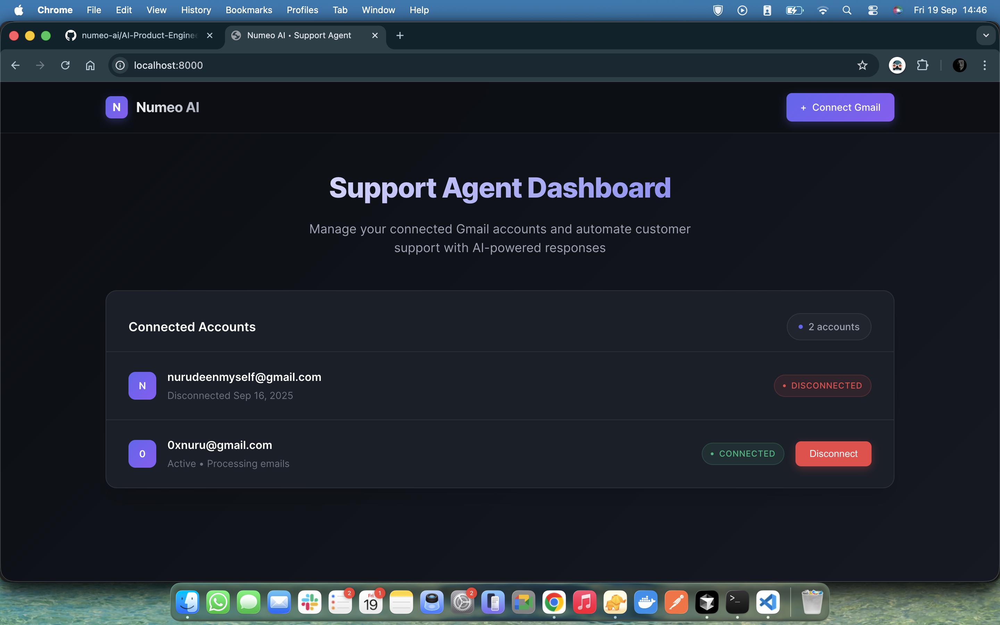

# Numeo AI – Customer Support Email Agent

This repository implements a customer support email agent with:

- Gmail OAuth connect/disconnect (supports multiple accounts)
- Real-time email ingestion via Gmail Push + Pub/Sub
- LLM-based categorization (question/refund/other)
- RAG answers for questions (pgvector + LangChain + LLM)
- Refund workflow with order lookups and reply automation

## Minimal Web UI



How to run locally in dev:

```bash
uv run uvicorn main:app --reload
# Browse http://localhost:8000/
```

## OAuth & Gmail Watch (ngrok + Pub/Sub)

1. ngrok (HTTPS for local OAuth callbacks)

```bash
ngrok http http://localhost:8000
# Copy the HTTPS forwarding URL, e.g. https://<subdomain>.ngrok-free.app
```

Update `GOOGLE_REDIRECT_URI` in `.env` and Google Console to:

```
https://<your-ngrok-subdomain>.ngrok-free.app/auth/google/callback
```

2. Environment: copy `.env.example` to `.env` and fill values (see `app/core/config.py` for keys)

3. Google Cloud Console setup

- Enable Gmail API and Cloud Pub/Sub APIs
- Create Pub/Sub topic (e.g., `gmail-push`)
- Create a PUSH subscription with endpoint:
  `https://<your-ngrok-subdomain>.ngrok-free.app/webhook/gmail-push`
- In Gmail `users.watch` calls, we use labels from `GMAIL_WATCH_LABEL_IDS` (defaults to `INBOX`).

4. Scopes used

- `gmail.readonly`, `gmail.send`

5. Start OAuth

```bash
open http://localhost:8000/auth/google
```

You can also start auth by clicking connect Gmail from UI.

## Prerequisites

- Python 3.11+
- PostgreSQL 14+
- `uv` (or `pip`)
- Google Cloud project with Gmail API and Pub/Sub enabled
- `ngrok` for HTTPS during local OAuth callbacks

## Environment

Copy `.env.example` to `.env` and populate required values.

## Install & Run

```bash
uv sync
uv run uvicorn main:app --reload
# Open http://localhost:8000/
```

## Database (migrations & seed)

```bash
# Apply migrations
uv run alembic upgrade head

# Seed demo orders
uv run python -m scripts.seed

```

## Email ingestion & classification

- Gmail sends a Pub/Sub push to `/webhook/gmail-push` when new mail arrives
- The backend fetches new messages since `last_history_id`, parses and persists them
- Inbound emails are queued for background classification (question/refund/other)
- Refund emails are routed to the refund service; questions go to RAG

## RAG (pgvector)

1. Ensure the `vector` extension is installed/enabled on your PostgreSQL server

```sql
CREATE EXTENSION IF NOT EXISTS vector;
```

2. Ingest the knowledge base from `knowledge/docs/`

```bash
uv run python -m scripts.ingest_kb
```

RAG uses pgvector as the vector store and LangChain for retrieval and generation.

## Endpoints (dev)

- `GET /` — Web UI (accounts)
- `GET /auth/google` — start OAuth
- `GET /auth/google/callback` — OAuth callback
- `POST /webhook/gmail-push` — Gmail Pub/Sub push endpoint
